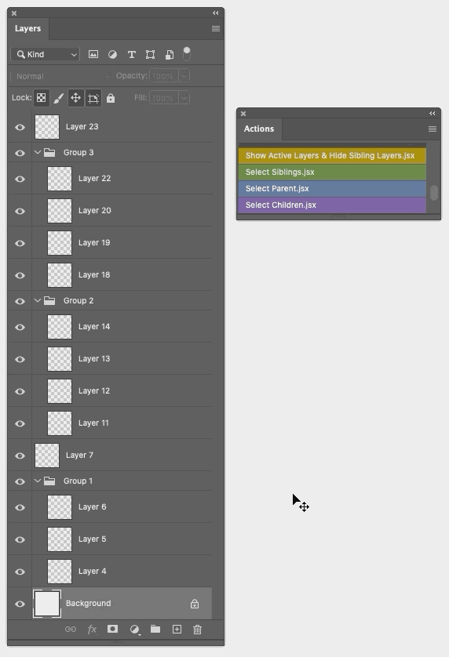

## basic (folder)

These scripts are pretty much just a way to use existing layer selection functionality that is blocked in certain keyboard layouts. It's all just scripting listener scripts... 

> Except for `Select Next Layer (invisible or not).jsx` and `Select parent group.jsx` which add new functionality. Note that the advanced folder has a slightly more advanced version of the `Select parent group.jsx` script that can select multiple parents if the starting point is you have multiple layers selected inside separate folders.

## advanced (folder)

Aside from the obvious, the "advanced" scripts also consider each group a separate scope. For example if you select two separate groups and run `Select Children.jsx`, it selects the child layers inside both groups.

**Multi-group scope example:**

